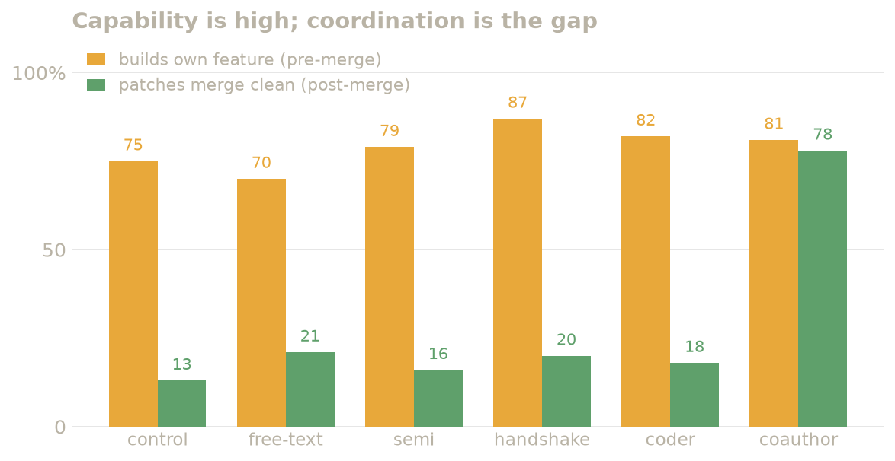
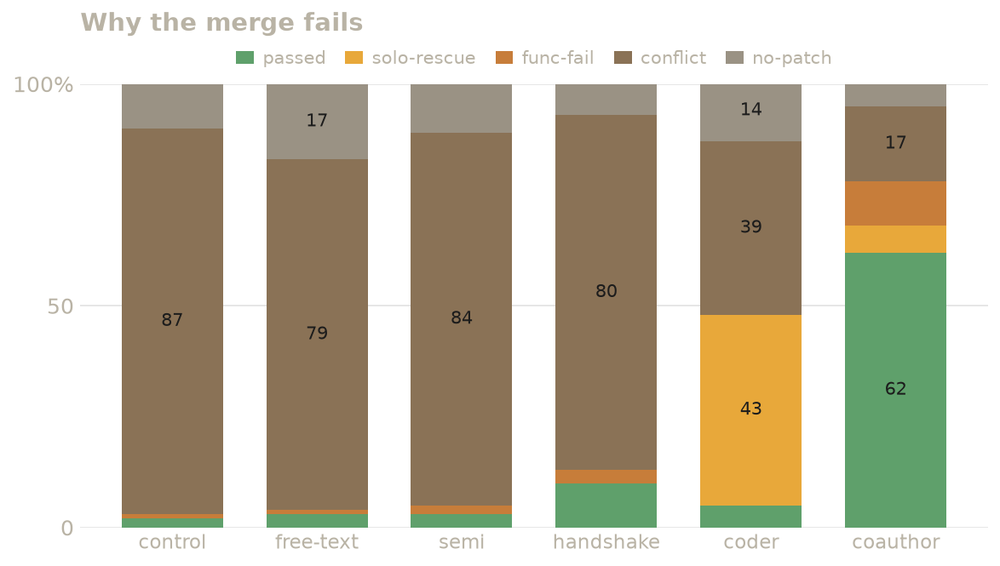

# Coordination-protocol study (nano) — results

**Does the *structure* of inter-agent messaging change how well two parallel
coding agents coordinate?** Six messaging protocols, compared head-to-head on the
same 20 conflicting feature-pairs, in the **no-git** coop setting so the only lever
is communication.

> **Headline.** On the pre-registered primary endpoint — **merge-clean rate** —
> only one protocol moves the needle. `coauthor_overlap`, in which the two agents
> jointly author byte-identical code for any construct they both touch, reaches
> **78% merge-clean vs 13% for the no-messaging control** (CMH OR 27.7, Holm-adjusted
> *p* < 0.0001). Every talk-only or plan-only protocol stays at the ~13–21% floor and
> does **not** survive multiple-comparison correction. A second new protocol,
> `designated_coder`, scores a high **58%** on the *secondary* endpoint
> (`both_passed`) but only **18%** merge-clean — statistically indistinguishable from
> the control on the primary — because its successes are an evaluation artifact
> (`solo_rescue`), not real merges. **Structure helps only when it resolves the
> overlap; declaring or planning around it does not.**

- **Dataset:** `dataset/subsets/nano.json` — 20 feature-pairs, one per task, ≤3 per
  repo, across 9 Python repos (the realized pre-registered `nano_py` set;
  `docs/nano_py_preregistration.md`). One pair per task ⇒ **stratify-by-pair =
  stratify-by-task**.
- **Model / adapter:** `claude-sonnet-5`, `claude_code`, coop setting, **git disabled**
  (independent patches combined by a naive `git merge`; a textual conflict fails the pair).
- **Replicates:** baselines & original protocols **k≈15**; the two new
  overlap-resolution protocols **k≈5** (300 vs ~100 pair-runs per arm — see *Threats*).
- **Analysis:** per-pair rates + Wilson 95% CIs → pooled **Cochran–Mantel–Haenszel**
  stratified by pair, Mantel–Haenszel common odds ratio, **Holm-corrected** across the
  contrast family. All numbers regenerate from `logs/` via
  `scripts/nano/analyze_study.py` (no third-party deps).

---

## 1. The six arms

| Arm | Run prefix | Messaging | What structure it adds |
|---|---|---|---|
| no-msg (control) | `nano_control` | none | agents cannot talk |
| free-text | `nano_msg` | free-form `coop-send` | prose, no schema |
| semi_structured | `nano_struct` | `semi_structured_v1` | every msg carries `type`+`files`+`summary` (declare intent; nothing enforces backing off) |
| plan_handshake | `nano_handshake` | `plan_handshake_v1` | 2-phase `PROPOSE`/`ACCEPT` of a **disjoint file split** before editing |
| **designated_coder** | `nano_dc` | `designated_coder_v1` | for each shared file, one agent **owns** and writes the union; the other **defers** + sends a spec |
| **coauthor_overlap** | `nano_coauthor` | `coauthor_overlap_v1` | for each overlapping construct, both agents **co-author byte-identical merged code** and write it verbatim |

The first four were reported previously; this study adds the two overlap-resolution
protocols (`designated_coder`, `coauthor_overlap`) and re-analyzes all six under the
pre-registered plan.

## 2. Metrics & the pre/post decomposition

Each pair-run is decomposed (`scripts/eval2.py`) into:

- **Pre-merge capability** — does each agent's patch pass *its own* feature's tests in
  isolation? ("Can the agent build its lane at all?")
- **Post-merge outcome** — combine both patches with a naive `git merge`, test the
  merged tree, and bucket via `merge_outcome`:

| bucket | meaning |
|---|---|
| `pass` | both applied, **merge clean/identical, both features pass** — honest success |
| `solo_rescue` | both features pass **but the merge did not go clean** — the eval's lead-alone fallback tested one agent's union patch by itself |
| `functional_fail` | merged clean but a feature's test fails |
| `textual_conflict` | `git merge` conflicts (auto-fail) |
| `missing_patch` | an agent produced no applicable patch |

**Endpoints (pre-registered).**
- **PRIMARY = merge-clean rate** — the coordination-specific metric: did the two
  *independent* patches combine without conflict? Operationalized as merge status in
  `{clean, identical}` (the pipeline's `MERGE_OK`). `identical` — both agents produced
  byte-identical merged code — is a conflict-free merge; excluding it would perversely
  penalize a protocol for succeeding by convergence. (The clean/identical split is
  reported separately in §5 for transparency.)
- **SECONDARY = `both_passed`** — strict end-to-end pass on the merged tree. Note it
  counts `solo_rescue`, so it can be inflated by *one* agent doing both jobs.

**Pre-registered post-hoc exclusions** (judged on the control arm only, never on a
messaging arm): drop a pair if control `both_passed` > 60% (**no conflict bite** — the
naive merge already works) or if capability is below the floor. Two pairs were dropped
for conflict-bite (`llama_index/18813`, control both 93%; `pallets_click/2956`, 73%);
no pair hit the capability floor. **Validated set = 18 pairs.**

## 3. PRIMARY endpoint — merge-clean

Pooled over the 18 validated pairs (Wilson CIs descriptive; CMH is the inferential test):

| Arm | runs | applied | **merge-clean (primary)** | both_passed (secondary) |
|---|---|---|---|---|
| no-msg (control) | 270 | 89% | **13%** [10–18] | 2% [1–4] |
| free-text | 270 | 83% | **21%** [17–26] | 3% [2–6] |
| semi_structured | 270 | 89% | **16%** [12–21] | 3% [2–6] |
| plan_handshake | 270 | 93% | **20%** [16–25] | 10% [7–15] |
| designated_coder | 88 | 86% | **18%** [12–28] | 58% [48–68] |
| **coauthor_overlap** | 89 | 94% | **78%** [68–85] | 69% [58–77] |



**CMH, stratified by pair, Holm-corrected across the family:**

| Contrast | base → arm | CMH OR | *p* (raw) | *p* (Holm) | |
|---|---|---|---|---|---|
| free-text vs control | 13% → 21% | 1.79 | 0.021 | 0.105 | ns |
| semi_structured vs control | 13% → 16% | 1.24 | 0.459 | 1.000 | ns |
| plan_handshake vs control | 13% → 20% | 1.63 | 0.040 | 0.159 | ns |
| designated_coder vs control | 13% → 18% | 1.43 | 0.353 | 1.000 | ns |
| **coauthor_overlap vs control** | 13% → 78% | **27.72** | <0.0001 | **<0.0001** | **✓** |
| **coauthor_overlap vs plan_handshake** | 20% → 78% | **10.39** | <0.0001 | **<0.0001** | **✓** |
| **coauthor_overlap vs designated_coder** | 18% → 78% | **16.03** | <0.0001 | **<0.0001** | **✓** |
| designated_coder vs plan_handshake | 20% → 18% | 0.91 | 0.888 | 1.000 | ns |

**Reading it:**
1. **`coauthor_overlap` is the only arm that improves the primary endpoint** — and by a
   lot (13% → 78%, a ~6× lift), significant against the control *and* against both the
   best prior protocol (`plan_handshake`) and the other new protocol.
2. **Talk-only and plan-only protocols do not survive correction.** free-text (raw
   *p* = 0.021) and plan_handshake (raw *p* = 0.040) look suggestive but fall out under
   Holm — consistent with the intrinsic-collision floor (§7).
3. **`designated_coder` is no better than `plan_handshake` on the primary** (OR 0.91,
   ns). Its headline comes entirely from the secondary — see §4.

## 4. SECONDARY endpoint — `both_passed`, and the solo_rescue divergence

| Contrast | base → arm | CMH OR | *p* (Holm) | |
|---|---|---|---|---|
| plan_handshake vs control | 2% → 10% | 5.93 | 0.0001 | ✓ |
| **designated_coder vs control** | 2% → 58% | 75.6 | <0.0001 | ✓ |
| **coauthor_overlap vs control** | 2% → 69% | 90.2 | <0.0001 | ✓ |
| coauthor_overlap vs plan_handshake | 10% → 69% | 18.9 | <0.0001 | ✓ |
| designated_coder vs plan_handshake | 10% → 58% | 20.9 | <0.0001 | ✓ |
| **coauthor_overlap vs designated_coder** | 58% → 69% | 1.78 | 0.476 | **ns** |

On the secondary, `designated_coder` (58%) and `coauthor_overlap` (69%) are **not
significantly different**. But on the primary they are worlds apart (18% vs 78%). That
gap is the whole story: **`designated_coder`'s `both_passed` is `solo_rescue`, not a
merge.** The failure taxonomy makes the mechanism explicit.

## 5. Failure taxonomy & merge outcome (validated set)

| Arm | `pass` | `solo_rescue` | `functional_fail` | `textual_conflict` | `missing_patch` |
|---|---|---|---|---|---|
| no-msg (control) | 2% | 0% | 1% | **87%** | 11% |
| free-text | 3% | 0% | 1% | **79%** | 17% |
| semi_structured | 3% | 0% | 2% | **84%** | 11% |
| plan_handshake | 10% | 0% | 3% | **80%** | 7% |
| designated_coder | 5% | **43%** | 0% | 39% | 14% |
| **coauthor_overlap** | **62%** | 6% | 10% | 17% | 6% |



Merge-status split (per pair-run):

| Arm | identical | clean | conflicts/other |
|---|---|---|---|
| no-msg → plan_handshake | 0% | 13–21% | 79–87% |
| designated_coder | 1% | 17% | 82% |
| **coauthor_overlap** | **29%** | **48%** | 22% |

- **`designated_coder` wins on a technicality.** Only 5% of its pair-runs merge clean;
  **43% are `solo_rescue`** and **39% still hard-conflict** (+14% missing a patch). The
  designated owner writes both features, so *its* patch passes both suites — but the
  deferring agent keeps editing the shared file anyway (a behavioural tic: the coding
  agent won't leave its own feature's file untouched), so the *actual* two-way merge
  conflicts 82% of the time. High `both_passed`, broken merge.
- **`coauthor_overlap` fixes the merge itself.** `textual_conflict` collapses from
  ~80% to **17%**, and it is the only arm with meaningful `identical` merges (29%) —
  the direct signature of the protocol working: both agents emit the same merged code.

## 6. Worked example — `openai_tiktoken`, pair `f2_f6`

Both features must add a keyword-only parameter to the **same** `Encoding.encode()`
signature. This pair conflicts in 93% of no-msg runs; `coauthor_overlap` merges it
clean in **5/5**.

**The collision (no-msg control).** Two independent patches, same insertion point:

```python
# agent2 (feature 2) — adds return_positions + widens the return type
         disallowed_special: Literal["all"] | Collection[str] = "all",
+        return_positions: bool = False,
-    ) -> list[int]:
+    ) -> list[int] | tuple[list[int], list[int]]:

# agent6 (feature 6) — adds transformers at the SAME line
         disallowed_special: Literal["all"] | Collection[str] = "all",
+        transformers: Callable[[str], str] | Sequence[Callable[[str], str]] | None = None,
     ) -> list[int]:
```
→ `git merge`: **conflict**. No amount of *talking about* the file partitions a single
signature line; `plan_handshake` and `semi_structured` conflict here too.

**`designated_coder`.** Feat-2 CLAIMs `core.py`, feat-6 DEFERs + sends a spec — correct
negotiation. But feat-6 still edits `encode()` → merge = **conflicts**, `both_passed` =
True via `solo_rescue`. The merge is not actually usable.

**`coauthor_overlap`.** The agents discover the overlap, co-author one merged
signature carrying **both** parameters, and converge on byte-identical text:

```
agent2 → agent1  SURVEY  "Adding 'transformers' param to encode()"
agent1 → agent2  SURVEY  "Adding return_positions param to encode()"
agent2 → agent1  DRAFT   region=encode()  <full merged signature, both params>
agent1 → agent2  DRAFT   region=encode()  <full merged signature, both params>
agent1 → agent2  AGREE   "Your last AGREE does NOT byte-match what I sent…"   # they re-converge
agent2 → agent1  AGREE   "…to break the loop, finalizing on this exact text"
both   → DONE            "Implemented the agreed merged encode() verbatim"
```

Both patches end **byte-identical** in `encode()`:

```python
         disallowed_special: Literal["all"] | Collection[str] = "all",
+        transformers: Callable[[str], str] | Sequence[Callable[[str], str]] | None = None,
+        return_positions: bool = False,
-    ) -> list[int]:
+    ) -> list[int] | tuple[list[int], list[int]]:
```
→ `git merge`: **identical** → both features pass. This is the mechanism the aggregate
29%-identical rate is built from. (Note the transcript even shows the protocol's known
hard part — reproducing the agreed block *exactly* — surfacing as a brief AGREE/re-DRAFT
loop before they lock the text.)

## 7. Why talk-only protocols hit a floor

Capability is **not** the bottleneck: pre-merge, each agent solves its own feature in
**70–87%** of runs across all arms (`nano_control` 75%, `nano_msg` 70%, `nano_struct`
79%, `nano_handshake` 87%, `nano_dc` 82%, `nano_coauthor` 81%; `eval2.py`). Agents can
build their lanes; they fail to *combine* them.

The reason is structural to the dataset — and it's what makes nano a sharp instrument.
A hotspot analysis of the conflicting pairs found **19/20 pairs collide on the same file
every repeat**, and 100% of the textual conflicts are **same-line / same-construct
overlaps** (two features both editing one signature, import block, or dispatch table).
Such a construct **cannot be partitioned by ownership** — there is no line to hand off.
So protocols whose move is "agree who edits what" (`plan_handshake`) or "declare what
you touch" (`semi_structured`) are bolted to a ~80% textual-conflict floor. The only
conflict-free moves for two *independent* patches are (a) exactly one patch touches the
construct — `designated_coder`'s intent, defeated in practice by the deferring agent
still editing — or (b) both patches make the **identical** change — `coauthor_overlap`,
which works.

## 8. Findings

1. **Structure helps only when it *resolves* the overlap.** Declaring it
   (`semi_structured`), planning around it (`plan_handshake`), or assigning ownership
   without enforcement (`designated_coder`) leaves the primary endpoint at the floor.
   Converging on identical code (`coauthor_overlap`) is the only lever that moves it.
2. **Beware `both_passed` alone.** It rewards `solo_rescue` — one agent doing both jobs
   — which is not coordination. On the pre-registered *primary* (merge-clean),
   `designated_coder` is no better than a plan handshake and far behind co-authoring.
3. **Pure communication can replicate what a shared repo buys you.** `coauthor_overlap`
   with **no git** (78% merge-clean, 69% both) matches or beats `plan_handshake` **with**
   a shared git repo (66% / 73%; §9) — a well-designed protocol closes the git gap
   through communication alone.
4. **Capability is high everywhere; coordination is the gap.** ~70–87% of features are
   solvable alone, but only 2–13% of *pairs* merge clean without a resolution protocol.

## 9. Reference appendix — git arms & solo (context, not in the primary comparison)

The study isolates *pure communication* by disabling git. For context, the same pairs
with a **shared git repo** (3-way merge; full 20-pair set, k=5):

| Arm | merge-clean | both_passed |
|---|---|---|
| no-msg + git (`nano_nomsg_git`) | 15% | 13% |
| free-text + git (`nano_free_git`) | 51% | 82% |
| plan_handshake + git (`nano_hs_git`) | 66% | 73% |

Git alone (no messaging) barely helps — a 3-way merge still conflicts on same-line
edits. Git + messaging helps a lot (as expected; this is the confound we removed). The
notable point (Finding 3): **no-git `coauthor_overlap` ≈ with-git `plan_handshake`.**

Solo capability ceiling (`nano_solo`, one agent per feature): 52% of features pass solo
— lower than the coop pre-merge capability because `nano_solo` used a *different* feature
pairing; treat as indicative only.

## 10. Threats to validity

- **Unequal k.** Baselines/original protocols k≈15; new protocols k≈5. CMH handles
  unequal stratum sizes, and the new-protocol effects are enormous (OR ≫ 10), so power
  is not the concern — but the new arms' per-pair CIs are wider. Topping both new arms to
  k=10 was planned (batches 3–4) and cut when the wrapper hit its token cap; the balanced
  k=5 comparison was pre-designated as sufficient.
- **`solo_rescue` inflates the secondary** — the entire reason merge-clean is the
  pre-registered *primary*. Reported both, and diagnosed the divergence (§4–5).
- **Capability-floor exclusion could not be computed from the control arm** (the older
  `nano_control`/`nano_msg` eval records predate the integrated pre-merge test). Judged
  instead from the arms that carry it (86–97% ≥1-feature-buildable) and the eval2
  capability read (70–87%); no pair is near the floor, so the floor is moot. The
  conflict-bite ceiling (the operative exclusion) *is* judged on control as pre-registered.
- **`dottxt_ai_outlines`** tests (2 pairs) are `not_computable_locally` (time out in
  local Docker); they contribute missing/short reps, not silent passes.
- **Single model** (`sonnet-5`), **single curated 20-pair subset**, all Python. Inference
  is conditional on these pairs (one pair per task; no per-repo/domain claims). The
  behavioural confound in `designated_coder` (deferring agent keeps editing) may be
  model- and prompt-specific.

## 11. Reproducibility

```bash
# regenerate every table/number in §3–5 & appendix from logs/ (no evals, no deps):
uv run python scripts/nano/analyze_study.py --json study.json

# regenerate the figures in this doc (docs/figures/nano_study/*.png):
uv run --with matplotlib python scripts/nano/make_figures.py

# per-feature pre/post decomposition (capability + buckets) for any arm:
uv run python scripts/eval2.py nano_coauthor    # -> logs/nano_coauthor/eval2_rows.csv

# how the two new arms were run (no-git coop, k=5 each):
uv run cooperbench run --setting coop -a claude_code -m claude-sonnet-5 \
  --subset nano -c 2 --eval-concurrency 2 --repeats 5 \
  --structured-messaging schemas/coauthor_overlap.toml -n nano_coauthor
```

- **Schemas:** `schemas/{coauthor_overlap,designated_coder,plan_handshake,semi_structured}.toml`
- **Subset:** `dataset/subsets/nano.json` (20 pairs); pre-registration
  `docs/nano_py_preregistration.md`
- **Analysis:** `scripts/nano/analyze_study.py` (multi-arm CMH/Holm/Wilson, reuses
  `scripts/nano/analyze.py` primitives); `scripts/eval2.py` (decomposition)
- **Raw:** `logs/<arm>_<k>/coop/<repo>/<task>/f<i>_f<j>/{eval.json,result.json,agent*_sent.jsonl,agent*.patch}`

## Appendix — per-pair merge-clean rate (validated set)

| pair | control | free | struct | handshake | dc | coauthor |
|---|---|---|---|---|---|---|
| dottxt_ai_outlines/1371 (1,2) | 7% | 20% | 0% | 7% | 0% | 80% |
| dottxt_ai_outlines/1655 (8,10) | 13% | 27% | 20% | 7% | 40% | 80% |
| dspy/8394 (3,5) | 7% | 20% | 7% | 7% | 20% | 80% |
| dspy/8587 (4,5) | 7% | 20% | 0% | 13% | 60% | 60% |
| dspy/8635 (1,3) | 27% | 40% | 33% | 60% | 20% | 75% |
| huggingface_datasets/3997 (1,5) | 7% | 40% | 40% | 87% | 25% | 60% |
| llama_index/17070 (1,3) | 7% | 13% | 13% | 0% | 25% | 80% |
| llama_index/17244 (3,5) | 7% | 13% | 13% | 53% | 0% | 40% |
| openai_tiktoken/0 (2,6) | 7% | 13% | 13% | 0% | 0% | 100% |
| pallets_click/2068 (1,6) | 13% | 20% | 13% | 0% | 20% | 100% |
| pallets_click/2800 (1,7) | 13% | 20% | 13% | 27% | 40% | 80% |
| pallets_jinja/1465 (1,8) | 13% | 13% | 13% | 0% | 0% | 100% |
| pallets_jinja/1559 (2,4) | 13% | 13% | 13% | 33% | 40% | 100% |
| pallets_jinja/1621 (1,6) | 13% | 13% | 13% | 0% | 0% | 40% |
| pillow/25 (3,4) | 47% | 47% | 33% | 13% | 20% | 100% |
| pillow/68 (2,3) | 13% | 13% | 13% | 13% | 0% | 100% |
| pillow/290 (3,4) | 13% | 20% | 20% | 27% | 20% | 60% |
| samuelcolvin_dirty_equals/43 (5,7) | 13% | 13% | 13% | 13% | 0% | 60% |

*Excluded (conflict-bite ceiling, control both_passed > 60%): `llama_index/18813` (93%),
`pallets_click/2956` (73%).*

---

*Generated from `logs/` by `scripts/nano/analyze_study.py`; decomposition by
`scripts/eval2.py`. Analysis plan pre-registered in `docs/nano_py_preregistration.md`.
Arms: `nano_control`, `nano_msg`, `nano_struct`, `nano_handshake` (k≈15);
`nano_dc`, `nano_coauthor` (k≈5). No-git coop, `claude-sonnet-5`.*
