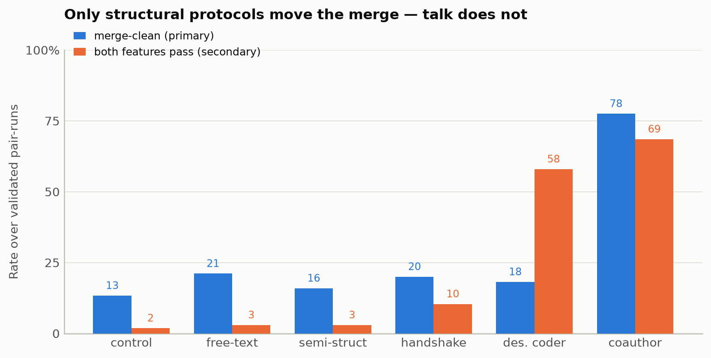
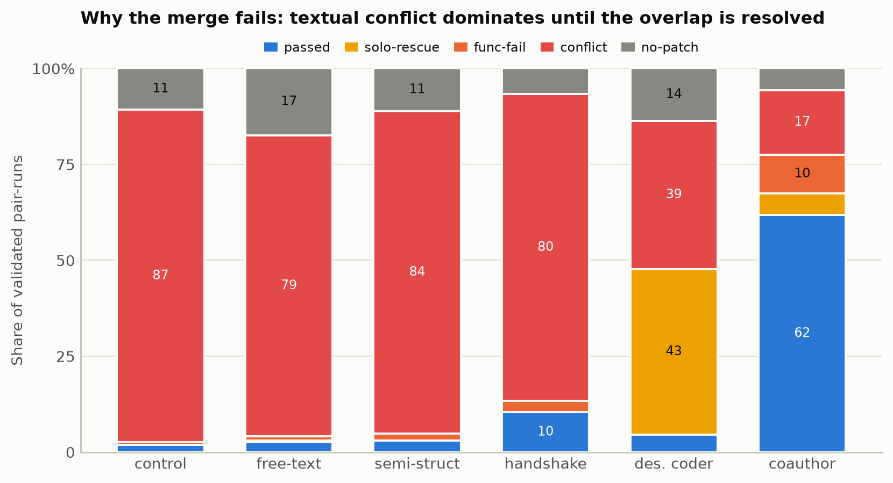

# Messaging Protocols for Two-Agent Coding: You Cannot Message Your Way Out of a Merge Conflict

*Standalone draft. In the larger paper this section sits between the replication study (which localises the two-agent coordination gap to patch integration) and the scaling study (which shows the cost of coordination grows super-proportionally in team size). It tests the remedy the replication's conclusion names: prompt-level protocols that resolve overlap directly.*

## Abstract

The replication established that the two-agent coordination gap on CooperBench is an *integration* gap, not a capability or communication deficit: paired agents write working code as often as solo agents, but their patches collide at merge time, and every jointly-failed pair that a single agent could solve was lost to a textual merge conflict. This raises the obvious question the base benchmark leaves open — can a better *coordination protocol* close that gap? We answer it with a pre-registered, capability-screened comparison of six protocols on a 20-pair Python subset (18 after pre-registered exclusions), all under one model (Claude Sonnet 5), one scaffold, and no shared git workspace, so that every arm differs *only* in its system prompt plus message-field validation. The result is sharp and one-directional: **you cannot message your way out of a merge conflict.** Every protocol that only changes what agents *say* — free-text messaging, enforced structured messaging, even a two-phase handshake that forces agents to agree a disjoint file split before editing — leaves the merge-clean rate at the no-messaging floor (13% → 16–21%, none significant after multiple-comparison correction). Only the protocols that change *who writes the overlapping code* move it: designating a single owner per shared file, and — decisively — having both agents co-author byte-identical merged code for each shared construct, which lifts the merge-clean rate from 13% to **78%** (Cochran–Mantel–Haenszel OR 27.7, Holm-corrected *p* < 0.0001) and the functional pass rate from 2% to 69%. Because the intervention is the prompt alone, this is direct evidence that prompt-level protocol design is sufficient to produce a large coordination improvement — and that the improvement comes from resolving the spatial collision, not from richer communication about it.

## 1. Introduction: from an integration gap to a protocol question

The replication study reproduced CooperBench's "curse of coordination" on our infrastructure with a paired design — a solo agent implementing both features of a pair versus two agents implementing one feature each and exchanging free-text messages — and then localised the gap. Two facts did the localising. First, pairing costs agents nothing in individual capability: an agent working alongside a partner passed its own feature's held-out suite about as often as a solo agent (21/47 pairs vs 20/47). Second, of the pairs a single agent demonstrably could solve, the cooperating pair delivered a small fraction, and *every* such loss was a textual merge conflict rather than a functional incompatibility. The coordination gap is, on this data, an integration gap: the agents consistently write working code but cannot place their edits so the contributions combine.

That finding names its own next experiment. If the bottleneck is integration and not communication, then interventions on the *communication channel* — more messages, better-structured messages — should do little, while interventions on *how edits are placed and combined* should do a lot. This paper builds a family of coordination protocols spanning exactly that axis and runs them head-to-head, holding everything else fixed. Crucially, every protocol is implemented purely as a system-prompt change plus validation of the message fields agents must fill — no model change, no fine-tuning, no scaffold change, and (deliberately) no shared git workspace. Keeping the agents fully isolated except for their messaging channel means any change in outcome is attributable to the protocol itself, giving a clean read on what a protocol can and cannot buy.

## 2. What the failures look like: five findings that predict the results

Before designing protocols we mechanically classified the coordination failures from the free-messaging replication run (the pairs where both agents built their own feature but the pair still failed). Five findings emerged, and together they form a set of predictions about which protocols should help.

- **F1 — Failure is spatial, not semantic.** Every coordination failure is a textual merge conflict. No capability-clean pair died of incompatible *semantics* after a clean merge; the code that both agents wrote was individually correct and would have worked, had it landed in the tree.
- **F2 — The overlap is task-inherent.** The two features' gold reference patches themselves collide (same file, overlapping hunks) in every failing pair — by construction, since CooperBench pairs are selected for gold-patch conflict. The collision is usually *within a single construct* (both features must edit the same function signature), not merely within the same file.
- **F3 — Information exchange is not the deficit.** The eventually-conflicting file was named in the conversation in every failure; agents declared the files they were touching. The channel carried the right information.
- **F4 — Agreement without resolution.** Agents identify the collision precisely, agree a plan ("let's each add our own parameter"), and still emit textually colliding edits. They agree *about* the overlap without *resolving* it.
- **F5 — Wrong merge model.** Agents reason as if they share a workspace ("your changes aren't in my copy yet — go ahead"), when in fact the evaluation performs a naive two-branch merge of their independent patches. Nothing in the free-messaging prompt tells them how their work will actually be combined.

The prediction that falls out: structuring or enriching the message channel (targets F3) should not help, because information already flows; planning a *file-level* split (targets F1 at the wrong granularity) should not help, because F2 says the overlap lives *inside* a shared construct where no disjoint file split exists; and only a protocol that *resolves the shared construct itself* — one writer, or identical writers (targets F4/F5) — should work.

## 3. The six protocols, with their system prompts

All six arms share one scaffold: each agent receives its own feature specification and a submission protocol (write your final unified diff to `patch.txt` before exiting). The arms differ only in the **cooperation-protocol block** appended to that prompt, and in the message-field validation the container enforces. In the structured arms, the container's messaging CLI hard-rejects any message that omits a required field or violates an enum, so "the structure was actually used" is not a confound: field *values* stay free text, only the coordination metadata is enforced. Each block below is reproduced verbatim as rendered to `agent1` (working alongside `agent2`); `<...>` placeholders are the CLI's own argument hints.

### 3.1 Control — no messaging

The control agent is never told it has a partner. It receives only its feature spec and the submission protocol; there is no cooperation block at all. This is the coordination *floor*: two isolated agents each implement their feature and the evaluator merges the two independent patches.

> *(no cooperation block)*

### 3.2 Free-text — unconstrained messaging

The replication's cooperative condition. Agents get a Redis-backed inbox and free-text `coop-send` / `coop-broadcast` / `coop-recv` commands, with a recommended-but-unenforced workflow. This targets F3 — give agents a channel and let them talk.

````
## Cooperation protocol

You are **agent1**, working alongside: **agent2**.
Each agent has been assigned a separate feature from the same codebase;
your features may overlap (touch the same files), so coordinate to avoid
clobbering each other's changes.

Available shell commands for cross-agent messaging (Redis-backed inbox,
one inbox per agent):

```bash
coop-send <recipient> "message text here"   # send to a specific peer
coop-broadcast "message text here"          # send to every other peer
coop-recv                                    # drain your inbox (prints JSON list)
coop-peek                                    # number of unread messages
coop-agents                                  # list every agent id
```

Recommended workflow:

1. At the start, `coop-broadcast` a short summary of your feature and
   which files you intend to touch.
2. Periodically `coop-recv` to read what your peers have sent — at
   minimum after major edits and before submitting.
3. If two agents need to modify the same file, coordinate explicitly
   (split the file, agree on one owner, or merge changes).
4. Keep messages short and focused: file names, function names, and
   one-sentence intents are usually enough.

Messages are not magic — your peers only know what you tell them.
````

### 3.3 Semi-structured — typed, field-validated messages

Every message must carry a `type` (CLAIM / INTENT / QUESTION / ANSWER / STATUS), the `files` it concerns, and a one-sentence `summary`; malformed messages are rejected. This targets F3 more forcefully: make agents declare, in a machine-checkable form, exactly what they will touch.

````
## Cooperation protocol (structured messaging)

You are **agent1**, working alongside: **agent2**.
Each agent has been assigned a separate feature from the same codebase;
your features may overlap (touch the same files), so coordinate to avoid
clobbering each other's changes.

Cross-agent messages are **structured** (schema `semi_structured_v1`). Every
`coop-send` / `coop-broadcast` MUST supply these fields as flags:

- `--type` (required) — one of: CLAIM, INTENT, QUESTION, ANSWER, STATUS: the kind of message
- `--files` (required): comma-separated files/regions you will touch (declare early to avoid clobbering peers)
- `--summary` (required): one-sentence intent
- `--blocked_on` (optional): anything you need from a peer before you can proceed

**Messages that omit a required field or use an out-of-enum value are
REJECTED — they exit non-zero and are NOT delivered to your peer.** Field
values are free text; only these coordination fields are enforced.

```bash
coop-send agent2 --type "CLAIM" --files "<files>" --summary "<summary>"                       # send to a specific peer
coop-broadcast --type "CLAIM" --files "<files>" --summary "<summary>"   # send to every other peer
coop-recv                                    # drain your inbox now (prints JSON list)
coop-await                                   # BLOCK until a peer replies, then drain
coop-peek                                    # number of unread messages
coop-agents                                  # list every agent id
```

Recommended workflow:

1. At the START, broadcast which files you intend to touch, before you begin editing.
2. `coop-recv` (or `coop-await`) to read your peers' messages — at minimum after
   major edits and before submitting — and if two agents want the same file,
   coordinate explicitly (split it, agree on one owner, or merge changes).
3. Keep each field short and specific.

Messages are not magic — your peers only know what you tell them.
````

### 3.4 Plan-handshake — agree a disjoint file split before editing

A two-phase protocol: in Phase 1 agents exchange PROPOSE / ACCEPT / REVISE messages (blocking on `coop-await`) until they have mutually agreed a disjoint partition of files, and *only then* may they edit. This targets F1 at file granularity — if the two agents own disjoint files, their patches cannot collide. F2 predicts it will fail, because the collision lives inside a shared construct that no file-level split can separate.

````
## Cooperation protocol (structured messaging)

You are **agent1**, working alongside: **agent2**.
Each agent has been assigned a separate feature from the same codebase;
your features may overlap (touch the same files), so coordinate to avoid
clobbering each other's changes.

Cross-agent messages are **structured** (schema `plan_handshake_v1`). Every
`coop-send` / `coop-broadcast` MUST supply these fields as flags:

- `--type` (required) — one of: PROPOSE, ACCEPT, REVISE, DONE: handshake message type
- `--my_files` (required): comma-separated files YOU will own and edit
- `--your_files` (optional): comma-separated files you propose your PARTNER owns
- `--note` (optional): optional short rationale

**Messages that omit a required field or use an out-of-enum value are
REJECTED — they exit non-zero and are NOT delivered to your peer.** Field
values are free text; only these coordination fields are enforced.

```bash
coop-send agent2 --type "PROPOSE" --my_files "<my_files>"                       # send to a specific peer
coop-broadcast --type "PROPOSE" --my_files "<my_files>"   # send to every other peer
coop-recv                                    # drain your inbox now (prints JSON list)
coop-await                                   # BLOCK until a peer replies, then drain
coop-peek                                    # number of unread messages
coop-agents                                  # list every agent id
```

Coordinate in TWO STRICT PHASES. Do NOT edit any file until Phase 1 is complete.

PHASE 1 — PLAN & HANDSHAKE (messages only, NO editing yet):
1. Immediately send a PROPOSE: `my_files` = the files YOU will own (from your
   feature), `your_files` = the files you think your PARTNER should own. Keep the
   two sets DISJOINT.
2. Run `coop-await` — it BLOCKS until your partner replies — to read their messages.
3. If their split gives you a disjoint set you can implement your feature with,
   reply ACCEPT (echo the agreed `my_files`). Otherwise reply REVISE with a better
   split and `coop-await` again. Repeat until you have RECEIVED an ACCEPT from your
   partner AND sent your own ACCEPT.
4. Only after you have received your partner's ACCEPT may you begin editing.

PHASE 2 — IMPLEMENT:
5. Edit ONLY the files in your agreed `my_files`. If you discover you genuinely must
   touch a file your partner owns, send a REVISE and re-agree BEFORE touching it.
6. Send DONE when your implementation is finished.

The whole point: agree a disjoint file split up front so your patches never collide
at merge time.

Messages are not magic — your peers only know what you tell them.
````

### 3.5 Designated-coder — one owner per shared file, the other sends a spec

For any file both features need, the pair assigns exactly one owner; the non-owner DEFERs and sends a precise SPEC of what its feature needs there, and the owner implements *both* features in that file while the non-owner leaves it untouched. This targets F4 directly: eliminate dual authorship of the shared construct. It should work *if* the deferring agent actually defers.

````
## Cooperation protocol (structured messaging)

You are **agent1**, working alongside: **agent2**.
Each agent has been assigned a separate feature from the same codebase;
your features may overlap (touch the same files), so coordinate to avoid
clobbering each other's changes.

Cross-agent messages are **structured** (schema `designated_coder_v1`). Every
`coop-send` / `coop-broadcast` MUST supply these fields as flags:

- `--type` (required) — one of: SURVEY, CLAIM, DEFER, SPEC, DONE: coordination message type
- `--files` (required): comma-separated files this message is about (all files you touch, for SURVEY; the owned/deferred file, for CLAIM/DEFER/SPEC)
- `--spec` (optional): when DEFERring, a precise self-contained description of what your feature needs done in that file, for the owner to implement
- `--note` (optional): optional short rationale or the function name(s) involved

**Messages that omit a required field or use an out-of-enum value are
REJECTED — they exit non-zero and are NOT delivered to your peer.** Field
values are free text; only these coordination fields are enforced.

```bash
coop-send agent2 --type "SURVEY" --files "<files>"                       # send to a specific peer
coop-broadcast --type "SURVEY" --files "<files>"   # send to every other peer
coop-recv                                    # drain your inbox now (prints JSON list)
coop-await                                   # BLOCK until a peer replies, then drain
coop-peek                                    # number of unread messages
coop-agents                                  # list every agent id
```

Coordinate in THREE STRICT PHASES. Do NOT edit any file until Phase 2 is agreed.

PHASE 1 — DISCOVER SHARED FILES (messages only, NO editing yet):
1. Immediately send a SURVEY: `files` = every file (and, in `note`, the specific
   function(s)) YOUR feature must edit. Be exhaustive and precise.
2. Run `coop-await` — it BLOCKS until your partner replies — to read their SURVEY.
3. Intersect the two file lists. The intersection is your SHARED files; everything
   else is yours alone.

PHASE 2 — ASSIGN A SINGLE OWNER PER SHARED FILE (still NO editing):
4. For EACH shared file, agree exactly ONE owner. Send CLAIM (`files` = the shared
   file(s) you will OWN and write) or DEFER (`files` = the shared file(s) you hand
   to your partner). Every shared file must end up with exactly one owner.
5. If you DEFER a file, you MUST send a SPEC for it: `files` = that file, `spec` =
   a precise, self-contained description of exactly what YOUR feature needs done in
   it (signatures, parameters, behaviour, return values, edge cases) — enough for
   the owner to implement your feature correctly without seeing your tests.
6. `coop-await` and repeat until every shared file has one owner AND every deferred
   file has a delivered SPEC that its owner has ACKNOWLEDGED (reply CLAIM echoing it).

PHASE 3 — IMPLEMENT:
7. Edit ONLY: your own (non-shared) files, plus the shared files you OWN. In each
   file you own that is shared, implement BOTH your feature AND your partner's SPEC.
8. Do NOT touch any shared file you deferred — leave it entirely to its owner.
9. Send DONE when finished.

The whole point: every shared file is written by exactly one agent, so independent
patches never collide there; the deferring agent's needs travel as a SPEC instead
of as conflicting edits.

Messages are not magic — your peers only know what you tell them.
````

### 3.6 Coauthor-overlap — both agents write byte-identical merged code

The most direct attack on F4/F5. Where two features overlap in one construct, the pair jointly authors the *full merged version* of that construct — one implementation carrying both features' behaviour — and both agents write that agreed text **byte-for-byte identically**. Git merges two independent patches that make an identical change to a region as `identical`, not a conflict; so each agent's patch already satisfies both features there, and the merge comes back clean by construction.

````
## Cooperation protocol (structured messaging)

You are **agent1**, working alongside: **agent2**.
Each agent has been assigned a separate feature from the same codebase;
your features may overlap (touch the same files), so coordinate to avoid
clobbering each other's changes.

Cross-agent messages are **structured** (schema `coauthor_overlap_v1`). Every
`coop-send` / `coop-broadcast` MUST supply these fields as flags:

- `--type` (required) — one of: SURVEY, DRAFT, AGREE, DONE: coordination message type
- `--files` (required): comma-separated files this message is about
- `--region` (optional): which overlapping construct this DRAFT/AGREE is about (e.g. 'encode() method')
- `--code` (optional): the complete verbatim source of the merged construct — must be byte-identical to your partner's
- `--note` (optional): optional short rationale or the construct name(s) involved

**Messages that omit a required field or use an out-of-enum value are
REJECTED — they exit non-zero and are NOT delivered to your peer.** Field
values are free text; only these coordination fields are enforced.

```bash
coop-send agent2 --type "SURVEY" --files "<files>"                       # send to a specific peer
coop-broadcast --type "SURVEY" --files "<files>"   # send to every other peer
coop-recv                                    # drain your inbox now (prints JSON list)
coop-await                                   # BLOCK until a peer replies, then drain
coop-peek                                    # number of unread messages
coop-agents                                  # list every agent id
```

Coordinate in THREE STRICT PHASES. Do NOT edit any file until Phase 2 is agreed.

PHASE 1 — DISCOVER OVERLAPPING CONSTRUCTS (messages only, NO editing yet):
1. Immediately send a SURVEY: `files` = every file YOUR feature must edit, and in
   `note` name the specific construct(s) — function/class/import block — you must
   change (e.g. "the `encode()` method").
2. Run `coop-await` — it BLOCKS until your partner replies — to read their SURVEY.
3. Identify OVERLAPPING constructs: any function/class/block you BOTH must edit.

PHASE 2 — CO-AUTHOR THE OVERLAP (still NO editing):
4. For EACH overlapping construct, jointly write the FULL merged version of it — one
   implementation that carries BOTH features' behaviour at once (e.g. the whole
   `encode()` method with BOTH new parameters AND both new code paths). Send a DRAFT:
   `region` = which construct, `code` = the complete verbatim source of the merged
   construct.
5. `coop-await`, compare against your partner's DRAFT character-for-character. If they
   differ in ANY way (order, whitespace, types, trailing commas), send a new DRAFT
   until you converge. Then send AGREE echoing the exact `code`. You must BOTH end
   Phase 2 holding the identical agreed text for every overlapping construct.

PHASE 3 — IMPLEMENT:
6. For every overlapping construct, write the agreed `code` VERBATIM — copy it
   exactly, do not paraphrase, retype, or reformat it. Both of you write the same text.
7. For any construct only YOU touch (not overlapping), implement it normally — but it
   must not overlap your partner's non-shared constructs.
8. Send DONE when finished.

The whole point: for every construct you both edit, your patch and your partner's
patch contain the IDENTICAL merged code, so git merges them as identical rather than
conflicting — and each patch already satisfies both features there.

Messages are not magic — your peers only know what you tell them.
````

## 4. Method

**Subset (nano).** The comparison runs on a capability-screened 20-pair Python subset. Restricting to a single language removes the language × repo × difficulty confound; taking one conflicting pair per task keeps the clusters independent and domain-diverse. Pairs are pre-filtered by static feature overlap (shared files and intersecting hunk ranges between the two gold `feature.patch`es) to raise the conflict hit-rate — a pre-filter, not the validity check.

**Pre-registration.** The design was fixed before any protocol result was seen (`docs/nano_py_preregistration.md`). The **primary endpoint** is the *merge-clean rate* — the fraction of pair-runs whose two independent patches merge without a textual conflict — because it is the coordination-specific quantity the replication implicated. The **secondary endpoint** is *both-passed*: both features' held-out suites pass on the merged tree. Validity exclusions are judged on the **control arm only**, never on a with-messaging outcome (that is the dependent variable): a pair is dropped if the model cannot build the features (neither feature passes independently in more than 10% of control runs) or if the naive merge already works (control both-passed > 60%, so there is no conflict to coordinate around). Of 20 pairs, 18 survive; the two dropped are ceiling cases (control already passes ≥ 73%).

**Runs and inference.** Each pair is run k ≈ 15 times per arm (≈ 270 pair-runs per arm for the full-set arms; the two overlap-resolution arms were run at k ≈ 5, ≈ 88–89 runs). All arms use Claude Sonnet 5 via the Claude Code scaffold, concurrency 2, and **no** shared git workspace. Per-arm rates carry Wilson 95% CIs (descriptive), and the inferential test is a **Cochran–Mantel–Haenszel** test stratified by pair — which respects the clustering (multiple runs of the same pair are not independent) rather than pooling runs as if they were. Contrasts are Holm-corrected across the family (every protocol vs control, plus three head-to-heads). Infrastructure failures (patch-apply errors, container crashes) are flagged and excluded from denominators, not scored as task failures.

**What varies between arms.** Only the cooperation-protocol block of the system prompt and the enforced message schema. Same model, same scaffold, same tasks, same evaluation. This is what licenses attributing any difference to the protocol.

## 5. Results

### 5.1 Endpoints

On the validated 18-pair set, the primary endpoint separates the six arms into two regimes. Every talk-only or plan-only protocol sits near the no-messaging floor; only the two overlap-resolution protocols move, and coauthor-overlap moves decisively.

| Arm (protocol) | runs | applied | merge-clean (primary) | both-passed (secondary) |
|---|---|---|---|---|
| control (no messaging) | 270 | 89% | **13%** [10–18] | 2% [1–4] |
| free-text | 270 | 83% | **21%** [17–26] | 3% [2–6] |
| semi-structured | 270 | 89% | **16%** [12–21] | 3% [2–6] |
| plan-handshake | 270 | 93% | **20%** [16–25] | 10% [7–15] |
| designated-coder | 88 | 86% | **18%** [12–28] | 58% [48–68] |
| **coauthor-overlap** | 89 | 94% | **78%** [68–85] | 69% [58–77] |

*Merge-clean = merge status in {clean, identical}; brackets are Wilson 95% CIs (descriptive).*



### 5.2 Inference (CMH, stratified by pair, Holm-corrected)

On the **primary endpoint**, coauthor-overlap is the *only* arm that beats control after correction — and it beats it by a wide margin, and beats the next-best protocols in head-to-heads too:

| Contrast | base | arm | CMH OR | *p* (Holm) | verdict |
|---|---|---|---|---|---|
| free-text vs control | 13% | 21% | 1.79 | 0.105 | ns — as predicted |
| semi-structured vs control | 13% | 16% | 1.24 | 1.000 | ns — as predicted |
| plan-handshake vs control | 13% | 20% | 1.63 | 0.159 | ns — as predicted |
| designated-coder vs control | 13% | 18% | 1.43 | 1.000 | ns — see §6 |
| **coauthor-overlap vs control** | 13% | 78% | **27.7** | **< 0.0001** | **improved** |
| coauthor-overlap vs plan-handshake | 20% | 78% | 10.4 | < 0.0001 | improved |
| coauthor-overlap vs designated-coder | 18% | 78% | 16.0 | < 0.0001 | improved |

On the **secondary endpoint** (both-passed), plan-handshake, designated-coder, and coauthor-overlap all beat control (Holm *p* = 0.0001, < 0.0001, < 0.0001; ORs 5.9, 75.6, 90.2). But designated-coder's high both-passed is not what it looks like — see §6.

### 5.3 The mechanism: where each pair-run lands

The failure taxonomy makes the mechanism visible directly. Every pair-run is classified by what actually happened at merge time.

| Arm | passed | solo-rescue | func-fail | textual conflict | no-patch |
|---|---|---|---|---|---|
| control | 2% | 0% | 1% | **87%** | 11% |
| free-text | 3% | 0% | 1% | **79%** | 17% |
| semi-structured | 3% | 0% | 2% | **84%** | 11% |
| plan-handshake | 10% | 0% | 3% | **80%** | 7% |
| designated-coder | 5% | 43% | 0% | 39% | 14% |
| **coauthor-overlap** | **62%** | 6% | 10% | **17%** | 6% |



The talk-only and plan-only arms leave the textual-conflict bucket essentially untouched at ~80–87%. Coauthor-overlap collapses it to 17% — and it is the only arm that produces **identical merges** (26 of its 89 runs, 29%; a further 48% merge cleanly). An identical merge — both agents emitting the same merged construct — is the protocol's intended fingerprint, and it appears in no other arm.

## 6. What the results show

**Capability was never the problem, and neither was communication.** In every arm where the pre-merge per-feature suite was recorded, at least one feature passed independently in 86–97% of pair-runs — the agents can build their features; the replication already showed pairing does not erode this. And under free-text messaging the eventually-conflicting file was named in conversation in essentially every failure. So the ~80% textual-conflict rate that persists through the free-text and semi-structured arms is not a failure to talk or to declare intent. It is F3 confirmed: the channel already carried the right information, and adding structure to it changes nothing.

**Planning around the overlap does not work, because the overlap cannot be partitioned.** Plan-handshake forces agents to agree a disjoint *file* split before editing, and they do — yet 80% of its runs still hard-conflict. This is F2 made concrete: the collision lives *inside* a shared construct (two features both editing one function signature), and no file-level partition can separate a single line. The handshake solves a problem the task does not have.

**Only changing who writes the overlapping code works.** The two protocols that alter authorship of the shared construct are the two that move the taxonomy — but they move it in tellingly different ways.

- *Coauthor-overlap* resolves the collision itself: both agents converge on identical merged text, git treats the region as an identical change rather than a conflict, and the merge-clean rate goes from 13% to 78% while both-passed goes from 2% to 69%. This is the intended mechanism working exactly as designed, down to the `identical`-merge fingerprint.
- *Designated-coder* is the instructive near-miss. Its negotiation succeeds — CLAIM, DEFER, and SPEC messages are exchanged correctly — but the deferring agent then **edits the shared file anyway**, so 39% of its runs still hard-conflict and its merge-clean rate stays at the floor (18%, ns). Its headline 58% both-passed is a `solo_rescue` artifact (43% of runs): the *owning* agent's union patch passes both suites by itself, while the partner's colliding patch is what the merge chokes on. In other words, the protocol that most explicitly demands commitment is undone by a *commitment failure* — agents agree to defer and then don't. This is a textbook instance of the original CooperBench taxonomy's commitment/expectation failures, reproduced under a protocol built to exploit commitment.

**The chain closes.** The failure analysis predicted that structuring communication (F3) and planning a file split (F1 at the wrong granularity, given F2) would not help, and that only resolving the shared construct (F4/F5) would. Every prediction holds. And because each arm differs *only* in its system prompt and message-field validation — no model change, no scaffold change, no shared workspace — the 13% → 78% jump is direct evidence that **prompt-level protocol design alone is sufficient to produce a large coordination improvement**, provided the protocol targets the operative failure mode rather than a plausible-looking bystander.

## 7. Limitations and what comes next

The scope is deliberately narrow: one model, one scaffold, and conflict-selected Python pairs chosen precisely because their features collide. The inference is conditional on these pairs — there are no per-repository or per-language claims (one pair per task). The two overlap-resolution arms ran at lower k (≈ 5 replicates) than the full-set arms; their effects are large enough to survive correction, but their CIs are correspondingly wider. And coauthor-overlap is demanding: it asks two agents to reproduce an agreed block byte-for-byte, which is why 17% of its runs still conflict and 10% fail functionally.

That residual is where the next problem begins. Once the spatial collision is solved, what remains is *semantic* coordination — agreeing not just where code goes but what the merged behaviour should be — the failure mode that dominates once merges stop conflicting. And a separate limit sits underneath all of this: the protocols here operate at team size two. The scaling study that follows holds a solo-achievable workload fixed and varies only the agent count, and finds a cost that grows super-proportionally in team size — a structural tax paid before any message is sent, which no messaging protocol can remove. The lesson of this study and the next are two halves of one point: a good protocol can close the *integration* gap at fixed team size, but nothing at the protocol level closes the *coordination* gap that opens as the team grows.

---

### Reproducibility

- **Numbers.** Every figure in §5 is computed by the pre-registered analysis, `masters_thesis/protocol_analysis/analyze.py`, over the six no-git arms in `logs/`. The frozen output is committed at `masters_thesis/protocol_analysis/data/nano_study.json`; regenerate it with `uv run python masters_thesis/protocol_analysis/analyze.py`.
- **Figures.** `masters_thesis/protocol_analysis/figures.py` reads that JSON (so plotted values cannot drift from the tables) and writes `masters_thesis/protocol_analysis/figures/fig1_endpoints.png` and `fig2_failure_taxonomy.png`. Run `uv run --with matplotlib python masters_thesis/protocol_analysis/figures.py`.
- **Protocol prompts.** The blocks in §3 are the verbatim cooperation-protocol sections rendered by `cooperbench.agents._coop.prompt.build_instruction`; the four structured schemas live in `src/cooperbench/agents/_coop/message_schema.toml` (semi-structured) and `schemas/{plan_handshake,designated_coder,coauthor_overlap}.toml`. Each arm is selected at run time by `--structured-messaging <schema>` (or `--no-messaging` for the control) on `cooperbench run --setting coop`.
